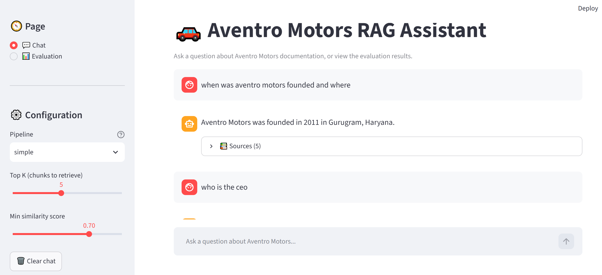

# Aventro Motors RAG System

A modular **Retrieval-Augmented Generation (RAG)** system for answering questions about **Aventro Motors**, a fictional Indian automobile manufacturer. The system ingests multi-format documentation, indexes it into a vector store, and answers natural-language questions by combining semantic retrieval with a Large Language Model.

Built as a refactor of an original single-notebook prototype into a clean, modular Python package with a command-line interface and an automated evaluation suite.

---

## Features

- **Multi-format ingestion** — PDF, DOCX, PPTX, HTML, MD, TXT, CSV
- **Config-driven** — all tunable parameters (chunk size, model names, top-k, thresholds) live in `src/rag/config.py`
- **Modular architecture** — separate packages for ingestion, embedding, retrieval, generation, and pipelines
- **Three RAG pipelines**:
  - `simple` — grounded answer from retrieved context only; abstains when the context is insufficient
  - `flexible` — same as simple when context exists; falls back to the LLM's general knowledge with an explicit disclaimer otherwise
  - `advanced` — adds source citations, per-chunk similarity scores, and a sources list
- **CLI entry points**:
  - `scripts/ingest.py` — (re)build the vector store from documents
  - `scripts/query.py` — ask questions with configurable mode, top-k, min-score, and log level
- **Google Gemini embeddings** — uses `gemini-embedding-001` (768-dim) via the Google Generative AI API
- **Fast LLM inference** — powered by Groq (cloud API)
- **Automated evaluation** — 40-question test set with LLM-as-judge, covering accuracy, abstain rate, and hallucination rate

---

## Installation

### Requirements

- **Python 3.10+**
- A **Groq API key** (free tier available at https://console.groq.com)
- A **Google API key** (free tier available at https://aistudio.google.com/app/apikey)

### Steps

1. **Clone the repository**

   ```bash
   git clone <your-repo-url>
   cd COMP693_26S2_Project_Yonggang_Chen_1157968
   ```

2. **Create and activate a virtual environment**

   ```bash
   python -m venv .venv

   # Windows
   .venv\Scripts\activate

   # macOS / Linux
   source .venv/bin/activate
   ```

3. **Install the package** (editable mode)

   ```bash
   pip install -e .
   ```

   Alternatively, using the requirements file:

   ```bash
   pip install -r requirements.txt
   ```

4. **Create a `.env` file** in the project root:

   ```env
   GROQ_API_KEY=your_groq_api_key_here
   GOOGLE_API_KEY=your_google_api_key_here
   ```

   > ⚠️ Never commit `.env` to version control. It is already listed in `.gitignore`.

5. **Build the vector store** (one-time setup):

   ```bash
   python scripts/ingest.py
   ```

   This will load all files under `data/Aventro Motors/`, split them into chunks,
   embed them via Google Gemini, and store them in a persistent ChromaDB
   collection at `data/vector_store/`.

---

## Usage

### Ask a question

```bash
python scripts/query.py "When was Aventro Motors founded?"
```

**Output:**

```text
Aventro Motors was founded in 2011 in Gurugram, Haryana.

=== Sources ===
  [score=0.8457] About Aventro Motors.docx (page unknown)
  [score=0.8417] About Aventro Motors.docx (page unknown)
  [score=0.8266] Aventro  Awards & Recognitions.md (page unknown)
```

### Options

| Flag | Default | Description |
|------|---------|-------------|
| `--top-k N` | `DEFAULT_TOP_K` from `config.py` | Number of chunks to retrieve |
| `--min-score F` | `DEFAULT_SCORE_THRESHOLD` from `config.py` | Minimum similarity score to keep a chunk |
| `--mode {simple,flexible,advanced}` | `simple` | Which RAG pipeline to use |
| `--log-level {DEBUG,INFO,WARNING,ERROR}` | `INFO` | Logging verbosity |

### Examples

```bash
# Retrieve more context
python scripts/query.py "How does Adaptive Cruise Control work?" --top-k 6

# Advanced mode: answer + citations + per-chunk scores
python scripts/query.py "Compare ACC and LKAS systems" --mode advanced --top-k 6

# Flexible mode: falls back to the LLM's general knowledge with a disclaimer
python scripts/query.py "What is the capital of France?" --mode flexible

# Stricter retrieval (higher similarity required)
python scripts/query.py "What is the price of the Aventro Storm SUV?" --min-score 0.75

# Quiet mode
python scripts/query.py "When was Aventro Motors founded?" --log-level WARNING
```

### Rebuilding the vector store

If you modify `config.py` (e.g. change `CHUNK_SIZE`) or add/update documents:

```bash
# Default: rebuild from scratch (clean)
python scripts/ingest.py

# Append to the existing collection (does NOT de-duplicate)
python scripts/ingest.py --append
```

> ⚠️ `--append` is a **no-dedupe append**. Running it twice on the same data
> will double the collection. Prefer the default (rebuild) unless you have a
> specific reason to append.

---

## Web UI

A Streamlit-based web interface is included for interactive Q&A.

### Run the web app

```bash
streamlit run app.py
```

Then open http://localhost:8501 in your browser.

### Features

- **Chat interface** — conversation history with a pinned input box at the bottom
- **Pipeline selector** — switch between `simple`, `flexible`, and `advanced` from the sidebar
- **Retrieval controls** — sliders for `top_k` and `min_score`
- **Source viewer** — expandable panel showing retrieved chunks, similarity scores, and previews
- **Evaluation dashboard** — view the automated evaluation results (summary table, per-question data, downloadable CSV) directly in the app

### Screenshot



---

## Project Structure

```text
COMP693_26S2_Project_Yonggang_Chen_1157968/
├── .env                          # API keys (not committed)
├── .gitignore
├── pyproject.toml
├── requirements.txt
├── uv.lock
├── README.md
│
├── app.py                        # Streamlit web interface
│
├── data/
│   ├── Aventro Motors/           # Source documents (pdf, docx, csv, ...)
│   └── vector_store/             # ChromaDB persistent storage
│
├── src/
│   └── rag/                      # Main Python package
│       ├── config.py             # All tunable parameters
│       ├── embedding/
│       │   └── embedding_manager.py
│       ├── ingestion/
│       │   ├── loaders.py        # Multi-format file loaders
│       │   ├── splitter.py       # Recursive text splitting
│       │   └── indexer.py        # Embed + store into ChromaDB
│       ├── retrieval/
│       │   ├── vector_store.py   # ChromaDB wrapper
│       │   └── retriever.py      # Query -> ranked chunks
│       ├── generation/
│       │   └── llm.py            # Groq LLM wrapper
│       └── pipeline/
│           ├── simple_rag.py
│           ├── flexible_rag.py
│           └── advanced_rag.py
│
├── scripts/
│   ├── ingest.py                 # CLI: build the vector store
│   └── query.py                  # CLI: ask a question
│
├── evaluation/
│   ├── test_questions.json       # 40 test questions
│   ├── judge.py                  # LLM-as-judge
│   ├── evaluate_rag.py           # Evaluation harness
│   └── results/                  # CSV, JSON, Markdown reports
│
├── tests/                        # Ad-hoc debugging scripts
│   ├── check_db.py
│   ├── debug_q010.py
│   ├── debug_script.py
│   └── show_abstain.py
│
├── Deliverables/
│   ├── DELIVERABLES.md
│   └── screenshots/
│
├── References/
│   └── REFERENCES.md
│
├── Journals/                     # Development journal
│
└── notebook/                     # Experimental notebooks
    ├── document.ipynb
    ├── experiment.ipynb
    └── pdf_loader_old.ipynb
```

### Module responsibilities

| Module | Responsibility |
|--------|----------------|
| `config.py` | All paths, model names, chunk sizes, thresholds |
| `ingestion/loaders.py` | Load files of different formats into LangChain `Document` objects |
| `ingestion/splitter.py` | Split documents into smaller chunks |
| `ingestion/indexer.py` | Orchestrate: embed chunks + store in the vector store |
| `embedding/embedding_manager.py` | Wrap Google Gemini embeddings |
| `retrieval/vector_store.py` | Wrap ChromaDB (persistent client + collection) |
| `retrieval/retriever.py` | Query the vector store, return ranked chunks with scores |
| `generation/llm.py` | Wrap Groq `ChatGroq` behind a single `invoke()` method |
| `pipeline/simple_rag.py` | Retrieve + generate, grounded in context only |
| `pipeline/flexible_rag.py` | Same as simple, but falls back to LLM general knowledge with a disclaimer |
| `pipeline/advanced_rag.py` | Adds citations, confidence score, source previews, history |

---

## Configuration

All tunable parameters live in `src/rag/config.py`:

| Constant | Default | Purpose |
|----------|---------|---------|
| `DEFAULT_TOP_K` | `5` | Number of chunks retrieved per query |
| `DEFAULT_SCORE_THRESHOLD` | `0.7` | Minimum similarity for a chunk to be kept |
| `CHUNK_SIZE` | `1000` | Max characters per chunk |
| `CHUNK_OVERLAP` | `200` | Overlap between adjacent chunks |
| `EMBEDDING_MODEL_NAME` | `gemini-embedding-001` | Google Gemini embedding model |
| `EMBEDDING_DIMENSION` | `768` | Embedding vector dimension |
| `CHROMA_COLLECTION_NAME` | `pdf_documents` | ChromaDB collection name |
| `GROQ_MODEL_NAME` | `Qwen/Qwen3.8-27B` | Groq model for generation |
| `GROQ_TEMPERATURE` | `0.1` | Sampling temperature |
| `GROQ_MAX_TOKENS` | `1024` | Max tokens per generation |

To change behavior globally, edit `config.py`. To override per query, use CLI
flags (`--top-k`, `--min-score`).

---

## How It Works

The system follows a standard RAG pipeline:

```text
data/Aventro Motors/
        │
        ▼
   loaders.py        Load PDF/DOCX/PPTX/HTML/MD/TXT/CSV into Documents
        │
        ▼
   splitter.py       RecursiveCharacterTextSplitter → chunks
        │
        ▼
 embedding_manager.py  gemini-embedding-001 (768-dim, cloud API)
        │
        ▼
  vector_store.py    ChromaDB (persistent, cosine similarity)
        │
        ▼
   retriever.py      Query → ranked chunks with similarity scores
        │
        ▼
   pipeline/*.py     simple / flexible / advanced
        │
        ▼
     llm.py          Groq ChatGroq → final answer
```

**Stages:**

1. **Ingestion** — `scripts/ingest.py` loads every supported file into LangChain `Document` objects, enriching each with metadata (source path, file type, loader name).
2. **Splitting** — `splitter.py` splits documents into overlapping chunks (`CHUNK_SIZE=1000`, `CHUNK_OVERLAP=200`).
3. **Embedding** — `embedding_manager.py` encodes each chunk into a 768-dim vector using Google's `gemini-embedding-001`.
4. **Indexing** — `vector_store.py` stores chunks, vectors, and metadata in a persistent ChromaDB collection.
5. **Retrieval** — `retriever.py` embeds the query, searches the collection, converts cosine distance to a similarity score, and filters by `min_score`.
6. **Generation** — the selected pipeline builds a prompt from the retrieved chunks and calls Groq's `ChatGroq`.

---

## Evaluation

The project includes an automated evaluation harness that runs **40 questions × 3 pipelines = 120 runs**, judged by an independent LLM (cross-model).

```bash
python evaluation/evaluate_rag.py
```

**Test set:** 20 in-domain questions (answerable from the corpus) and 20 out-of-domain questions (not in the corpus).

**Metrics:**

- In-domain accuracy and partial rate
- Out-of-domain abstain rate
- Hallucination rate
- Average top similarity score (in-domain and out-of-domain)

**Latest results:**

| Pipeline | In-domain accuracy | Combined | Out-of-domain abstain | Hallucination rate |
|---|---|---|---|---|
| simple | 90.0% | 95.0% | 100.0% | 0.0% |
| flexible | 90.0% | 95.0% | 100.0% | 0.0% |
| advanced | 90.0% | 95.0% | 100.0% | 0.0% |

See `evaluation/results/report.md` for the full breakdown.

---

## Tech Stack

| Layer | Tool / Library | Notes |
|-------|----------------|-------|
| Language | Python 3.10+ | |
| Package manager | `pip` + `pyproject.toml` | Editable install via `pip install -e .` |
| Document loading | `langchain-community` | Specialized loaders per file format |
| Text splitting | `langchain-text-splitters` | `RecursiveCharacterTextSplitter` |
| Embeddings | `langchain-google-genai` | `gemini-embedding-001` (768-dim), cloud API |
| Vector store | `chromadb` | Persistent, cosine distance |
| LLM | `langchain-groq` + Groq API | `ChatGroq` wrapper |
| Environment | `python-dotenv` | Loads `.env` |
| Numerics | `numpy` | Vector math |

---

## Roadmap / Future Work

Things intentionally **not** included in the initial refactor, but worth considering:

- **Unit tests** — cover loaders, splitter, retriever, and each pipeline (`tests/`).
- **Chunking strategy improvements** — the two known evaluation limitations (`q003`, `q015`) stem from chunk boundaries; a PPTX-aware parser or smaller `CHUNK_SIZE` could help.
- **Reranking** — add a cross-encoder reranker between retrieval and generation.
- **Real streaming** — use `llm.stream()` for token-by-token output.
- **Web search fallback** — extend `flexible_rag.py` to query a search API instead of relying only on the LLM's training data.
- **Web UI** — wrap the pipelines in a simple Streamlit/Gradio app.

---

## License

This project is developed as part of the **COMP693** coursework. Not licensed for redistribution.